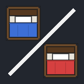
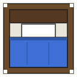
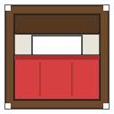

<div align="center">



# 🛏️ BED WARS — for Factorio

**Minecraft Bed Wars, rebuilt inside Factorio 2.1.**
Two islands. Two beds. Bridge the gap, break their bed, win.

*Built for a dad and his son who play Factorio together.*

&nbsp;&nbsp;&nbsp;&nbsp;
&nbsp;&nbsp;&nbsp;&nbsp;


</div>

---

## What is this?

A Factorio **mod that ships a complete PvP scenario**. You and your opponent
each spawn on an island floating in an endless sea. Resources rain from
generators, shops sell everything (crafting is *disabled* — this is Bed Wars,
not the factory), and at the end of a landfill bridge sits the only thing that
matters: **their bed**.

While your bed stands, you respawn. When it falls, you don't.
Last team breathing wins.

## ⚔️ How a game plays out

1. **Collect** — iron plates pour out of your island's generator. Walk over
   them to grab them.
2. **Shop** — spend iron at your  **Item Shop**:
   landfill, walls, ammo, turrets, armor… even a car.
3. **Push** — bridge to the **gold islands** (north & south) for gold, then to
   **mid** for emeralds — the top-tier currency for fortress walls,
   flamethrowers, and power armor.
4. **Upgrade** — the  **Team Upgrades**
   stall sells permanent buffs: Forge tiers, Sharpened Rounds, Swift Boots,
   a Healing Pool around your bed, an instant Bed Fortress.
5. **Break** — the enemy bed can't be shot (walls actually matter!). You must
   stand next to it and channel a ~3-second break while their turrets chew on
   you.
6. **Win** — bed down, defenders dead → victory fireworks → **REMATCH** button
   resets the entire map in seconds.

## 🕐 The clock is always ticking

| Time | Event |
| --- | --- |
| 12:00 | Emerald generators → **Tier II** |
| 24:00 | Emerald generators → **Tier III** |
| 30:00 | ⚠ Sudden-death warning |
| 32:00 | **All beds self-destruct** — no more respawns |
| 40:00 | Draw |

## 🎚️ Difficulties

| | 😌 Chill | ⚔️ Classic | 💀 Brutal |
| --- | --- | --- | --- |
| Resource speed | ×1.4 | ×1.0 | ×0.75 |
| Shop prices | 25% off | full | full |
| Respawn time | 8 s | 10 s | 15 s |
| Sudden death | never | 32:00 | 24:00 |

*Chill is perfect for a first game with a kid — fast resources, cheap toys, no
timer pressure.*

## 📦 Install

1. Copy (or junction) the `mod/` folder into your Factorio mods directory as
   `bed-wars`:
   - Windows: `%APPDATA%\Factorio\mods\bed-wars`
2. Launch Factorio → **New Game → Bed Wars → bedwars**.
3. Host picks a difficulty, both players pick sides, **START GAME**.
   (Starting solo works too, for exploring.)

Requires **Factorio 2.1+**, base game only — no DLC needed.

> [!IMPORTANT]
> **Play with ONLY Bed Wars enabled.** Every enabled mod's scripts run inside a
> scenario, and mods that assume a normal freeplay world (e.g. *Any Planet
> Start* and other planet mods) can crash the moment a player joins. Also,
> Factorio multiplayer requires both players to have **identical** mod lists —
> so a minimal list is what you want anyway.
>
> Easiest way: a second mods folder with just this mod in it, and a shortcut
> that launches `factorio.exe --mod-directory "<that folder>"`. Your normal
> modpack stays untouched for regular play.

## 🗺️ The map

```
                    ● gold island (N)
                   /
  ┌─────────┐     /   ┌──────┐    \     ┌─────────┐
  │  WEST   │ ~~ bridge ~ MID ~ bridge ~ │  EAST   │
  │ 🛏️ 🏪 ⛏️ │         │ 💎💎 │          │ ⛏️ 🏪 🛏️ │
  └─────────┘         └──────┘          └─────────┘
                   \
                    ● gold island (S)
```

Everything between islands is open water — every path to the enemy is a bridge
somebody chose to build, and bridges work both ways.

## 🔧 Tinkering

Every price, rate, distance, and timer lives in one file:
[`mod/scenarios/bedwars/lib/config.lua`](mod/scenarios/bedwars/lib/config.lua).
Want emeralds to spawn faster or power armor to cost 10? Change a number.
The pixel art is generated by
[`mod/tools/make-sprites.ps1`](mod/tools/make-sprites.ps1) — tweak the palette
and re-run.

Project docs: [`cliffnotes.md`](cliffnotes.md) (map of the code),
[`decisions.md`](decisions.md) (why things are the way they are),
[`verify.md`](verify.md) (headless test recipes).

---

<div align="center">

*Made with ❤️ (and three tiers of currency) — architected by Claude Fable,
built by a crew of Opus agents, verified against a real Factorio 2.1.11.*

**Now go break a bed.** 🛏️💥

</div>
